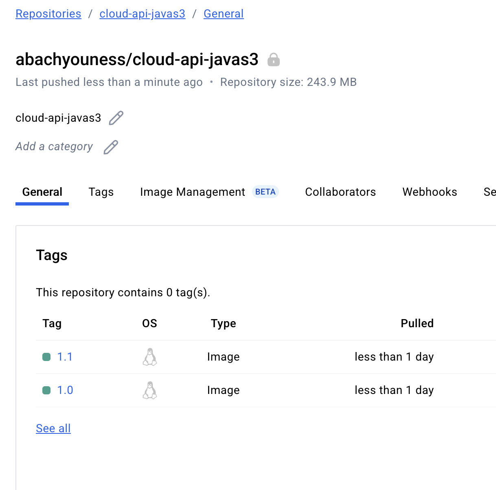

# Swagger 3 and Spring Boot example (with OpenAPI 3)

## Create image docker

---

build
docker build --pull --rm -f 'Dockerfile' -t 'cloudapijavas3:latest' '.'

tag
docker tag cloudapijavas3:latest abachyouness/cloud-api-javas3:1.0

push
docker push abachyouness/cloud-api-javas3:1.0

